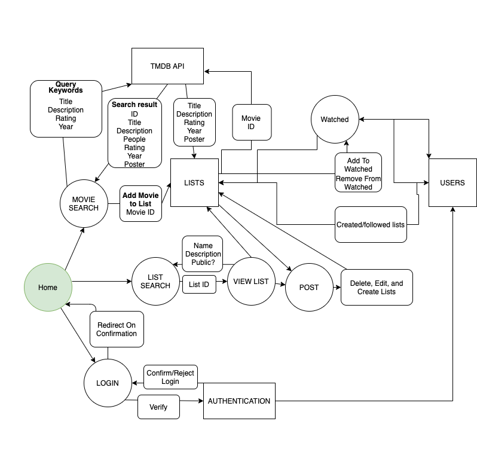
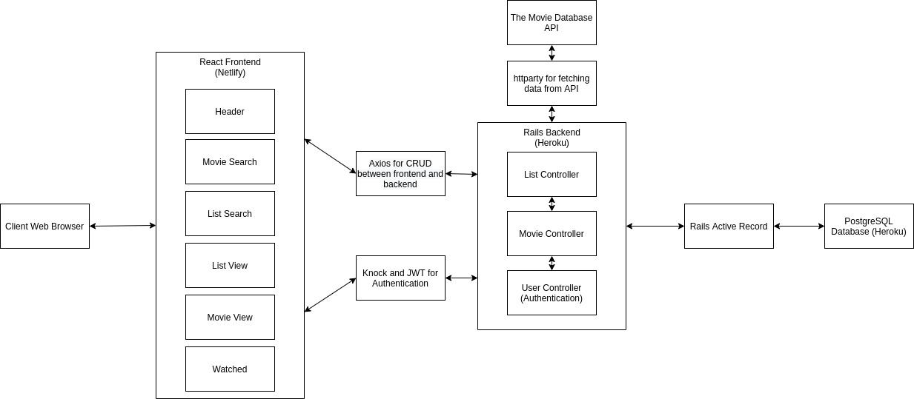
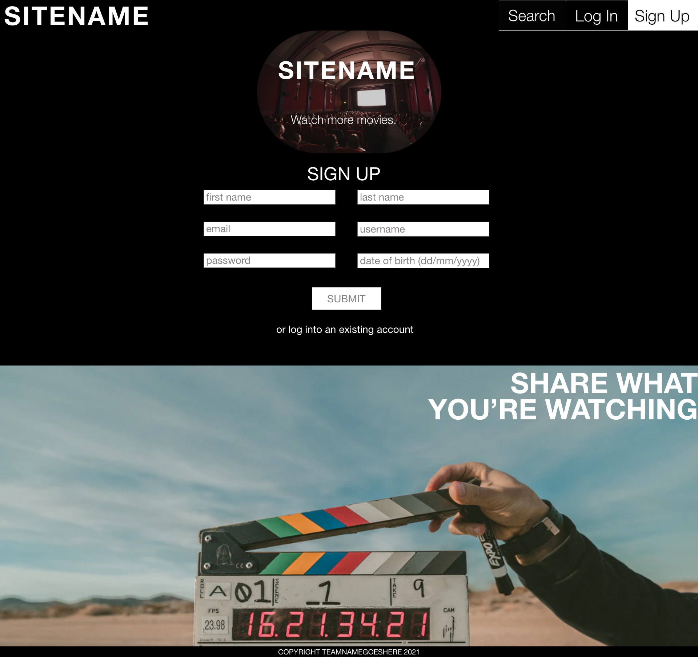

# Popcorn Bucket List
## Team Name Goes Here
Deployed Site: https://popcornbucketlist.com/

Frontend Repository: https://github.com/teamnamegoeshere/fullstack-frontend

Backend Repository: https://github.com/teamnamegoeshere/fullstack-backend

### Description

#### Purpose/ Conceptualisation

Popcorn Bucket List was initially derived from the Movie Scratch Off Posters and evolved into a multifaceted application. Notably entertainment consumption synonymous in todays culture. Hence Popcorn Bucket List tackles the chronic problem of the paradox of choice whereby essentially choice is conducive to paralysis rather than liberation as there are so many streaming services each with their own content libraries. Such browsing and information overload, is highlighted by threads on Reddit like “Anybody else really struggle with deciding on a movie to watch?” And the science of indecision; the notion that were you to calculate the amount of time you spend searching/deciding what to watch. 

#### Functionality and Features
As such Popcorn Bucket List puts the liberation and fun back into entertainment consumption! It functions as the digital destination for users to curate personalised movie To Watch Lists, from award winning films, old classics, genres, box office grosses and so on. Moreover, Popcorn Bucket List puts the peace of mind into keeping track of what movies you have and haven’t seen yet with a checkbox adding interactive element to the experience users can track movies they’ve watched are watching or want to watch.

Acting as a movie aggregation service the social aspect is a key feature of Popcorn Bucket List. Entertainment viewing is already social with people talking about what movies they’ve seen, they’re favourites and so forth. So with all this in mind Popcorn Bucket List parallels this evolving landscape and movie consumption culture and aftermath where everyone is a film critic. Users lists are visible to other users for inspiration. Notably Popcorn Bucket List is especially pertinent in coronavirus times when people are going online for entertainment streaming of movies has surged by 12%.

#### Target Audience
Popcorn Bucket List is the companion for avid or just amateur movie watches alike! Indeed there is an appeal of movies to all ages, genders, languages, socio economic status, as such Popcorn Bucket List caters to this inclusive and unifying nature. 

Popcorn Bucket List is a computer, tablet and mobile friendly companion for anyone with internet access and the basic technical knowhow. Furthermore considering the breadth of movies at everyone’s finger tips Popcorn Bucket List caters to users seeking a highly curated and social experience when it comes to deciding what to watch and keeping track of what they have watched.

#### Tech Stack

Front End
* HTML
* CSS
* JavaScript
* React

Back End
* Rails
* TMDB API - what we’ll be populating the movies for the website with
* PostgreSQL

Hosting
* Heroku -  back end
* Netlify - front end

Testing
* RSpec
* Jest
* Cypress

### Dataflow Diagram

### Application Architecture Diagram

### User Stories

#### Epic: Sign Up and Sign In
- As a **User** I want to **Sign up for an account** so that **my lists and watched titles are saved**

- As a **User** I want to **Sign in** so that **I can create, modify and delete my watch lists and watched titles**

#### Epic: Search

- As a **User** I want to **search for movies, tv show names and people** so that **I can select certain results and add them to a list or mark them as watched**

- As a **User** I want to **click on search results** so that **I can read more information such as synopsis, rating and people**

#### Epic: Lists

- As a **User** I want to **create named lists** so that **I can curate titles based on attributes like actors, genres, rating, director etc**

- As a **User** I want to **add a description to my lists** so that **there is information on the idea behind the list**

- As a **User** I want to **share lists I have created** so that **other users can find inspiration on what to watch**

- As a **User** I want to **search lists created on the platform** so that **I can find results relevant to my interests**

- As a **User** I want to **follow lists shared by other users** so that **I can find inspiration for what to watch next and track my progress**

- As a **User** I want to **view my created and followed lists** so that **I can see what I have made and am interested in following**

- As a **User** I want to **modify lists I have created and shared** so that **I can improve them**

- As a **User** I want to **delete lists I have created and shared** so that **I can remove lists created in error or I no longer want to display**

#### Epic: Profile

- As a **User** I want to **add lists to my profile** so that **I can track and share my progress in a category**

- As a **User** I want **my watched titles to appear in my profile** so that **I can see and share my progress**

- As a **User** I want to **remove started lists from my profile** so that **my profile is less cluttered and more relevant as my interests change**

#### Sprinkles

This list contains user stories from each of the Epics above that are not required for the MVP but would result in significant improvements for the user experience. These will be implemented as time allows.

- As a **User** I want to **edit my profile details** so that **I can keep my password secure and my email address and other details up to date**

- As a **User** I want to **add/update my profile image** so that **my profile can be more personalised and show some of my personality**

- As a **User** I want to **delete my account** so that **I can leave the service and my data is removed**

- As a **User** I want to **add my friends** so that **I can follow what they are watching and they can follow what I'm watching**

- As a **User** I want **titles I have watched to be automatically checked off new lists I create or follow** so that **I don't have to do it manually**

- As a **User** I want **the most popular lists a title is included in to appear in the entry** so that **I can choose lists based on my film/tv interests**

### Wireframes

#### Home Logged Out

Desktop:

Tablet:

Mobile:

#### Home Logged In

Desktop:

Tablet:

Mobile:

#### Sign Up

Desktop:

Tablet:

Mobile:

#### Log In

Desktop:

Tablet:

Mobile:

#### Profile

Desktop:

Tablet:

Mobile:

#### Search Logged Out

Desktop:

Tablet:

Mobile:

#### Search Logged In

Desktop:

Tablet:

Mobile:

#### Create List

Desktop:

Tablet:

Mobile:

#### View List Logged Out

Desktop:

Tablet:

Mobile:

#### View List Logged In

Desktop:

Tablet:

Mobile:

### Trello Screenshots

For this project the team made use of Trello for project management. The board can be found here: https://trello.com/b/DPS3LJow/full-stack-app

Tasks were converted into cards and given due dates and appropriate labels according to category, priority and estimated time to completion.

Cards were then discussed with the group and assigned to team members to lead and complete based on interests and skills. The cards then moved from left to right between lists depending on their current state. "To do", "In Progress", "Review/Testing" and "Complete".

Day 1:

Day 5:

Day 10:

Once User Stories were finalised by the team, they were added to Trello with corresponding labels and due dates:

